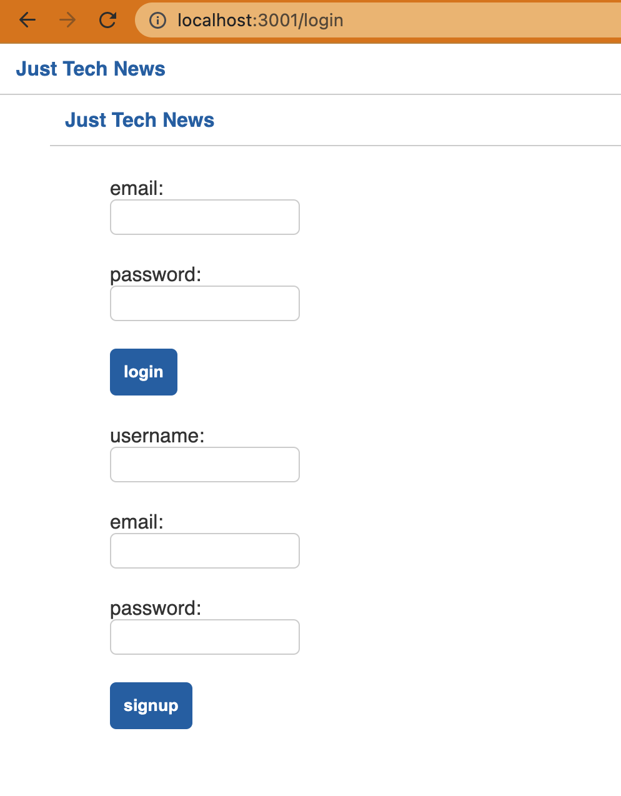
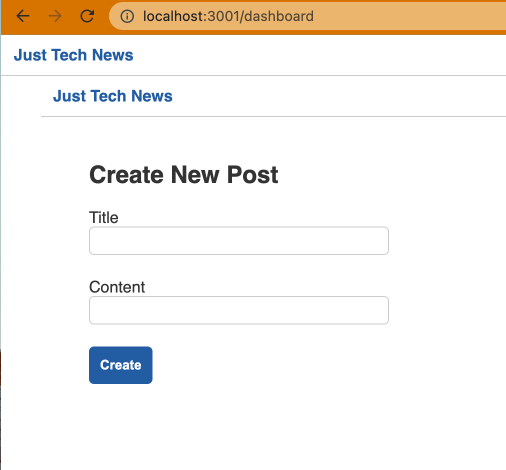
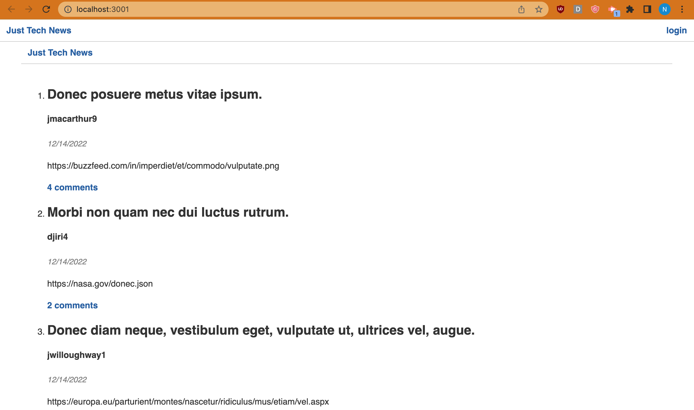
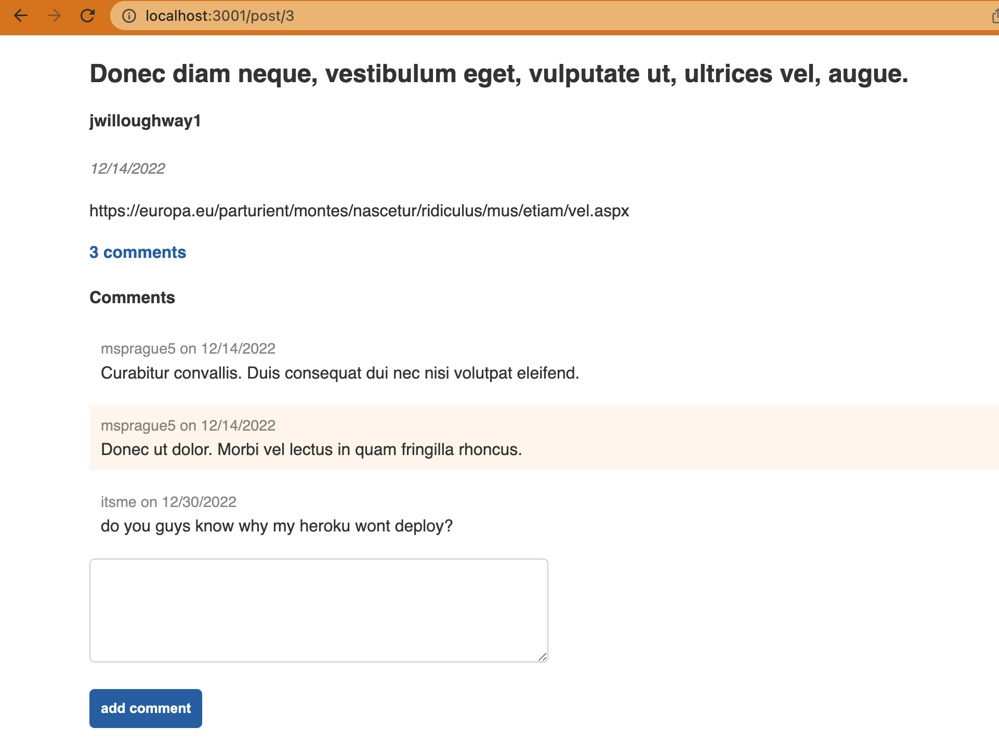
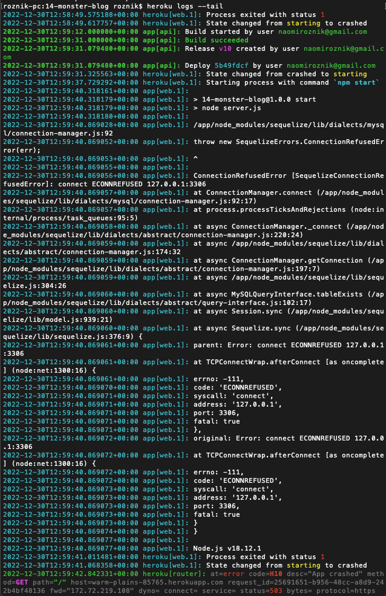
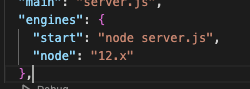

# Model-View-Controller (MVC) Challenge: Tech Blog

## Description

[Unsuccessful deployment #1](https://warm-plains-85765.herokuapp.com/) and [unsuccessful deployment #2.](https://n-roz.github.io/14-monster-blog/) 

```
Your challenge this week is to build a CMS-style blog site similar to a Wordpress site, where developers can publish their blog posts and comment on other developers’ posts as well. You’ll build this site completely from scratch and deploy it to Heroku. Your app will follow the MVC paradigm in its architectural structure, using Handlebars.js as the templating language, Sequelize as the ORM, and the express-session npm package for authentication.
```

```
MVC is a popular software-design pattern that organizes your app into the three following separate concerns:

Models: the core data of your app

Views: the UI components, such as your HTML layouts

Controllers: the link between your models and views
```

```
Set up the project. You’ll build off of the previous project by creating new GitHub issues and adding a style sheet.
Set up the template engine. You’ll install Handlebars and configure Express to use it as its template engine.
Create the homepage template. You’ll create a Handlebars template for the homepage, populated with dummy data.
Populate the template with Sequelize data. You’ll use a previously defined Sequelize query to populate the homepage with real data.
Create a login page. Both login and sign-up sections will display at once.
Add front-end logic to forms. We will add fetch requests to post to the server when a user logs in.
Create a session on the back end. We will keep track of users' sessions so that we can associate them with posts.
Add logic to destroy the session. The user will also be redirected upon logout.
Create a single post template. You’ll create a new Handlebars.js template to render a single post and all of its corresponding data.
Add upvote functionality. You’ll connect front-end and back-end logic to create a working upvote button.
Add comment functionality. You’ll connect front-end and back-end logic to create a working comment form.
Conditionally render the form elements. You’ll use Handlebars.js helpers to hide the form elements to users who aren’t logged in.
Conditionally render the login links. You’ll use Handlebars.js helpers to change the navigation links that a user sees based on their logged-in status.
Create a partial for post information. This will make the discussion around a post reusable.
Create a partial for comments. This will make the comment section reusable.
Write and fulfill test for date formats. All dates will follow the MM/DD/YYYY format.
Write and fulfill test for plural words. If there is one upvote or comment, then the word should be singular; otherwise, it should be plural.
Write and fulfill a test for URL formats. Long URLs should be shortened.
Add helper functions to Handlebar.js. We’ll need to tie all of the functions into the Handlebars.js engine.
Create the dashboard template. You’ll set up a basic Handlebars.js template and route for a new dashboard page.
Add data and logic to the dashboard. You’ll add Sequelize data and front-end JS logic to the dashboard page.
Protect routes with middleware. You’ll write a custom middleware function to restrict certain routes to only logged-in users.
Create an Edit Post page. You’ll create a dashboard template where users can edit and delete individual posts.
```

## User Story
```
AS A developer who writes about tech
I WANT a CMS-style blog site
SO THAT I can publish articles, blog posts, and my thoughts and opinions
```

## Acceptance Criteria
```
GIVEN a CMS-style blog site
WHEN I visit the site for the first time
THEN I am presented with the homepage, which includes existing blog posts if any have been posted; navigation links for the homepage and the dashboard; and the option to log in
WHEN I click on the homepage option
THEN I am taken to the homepage
WHEN I click on any other links in the navigation
THEN I am prompted to either sign up or sign in
WHEN I choose to sign up
THEN I am prompted to create a username and password
WHEN I click on the sign-up button
THEN my user credentials are saved and I am logged into the site
WHEN I revisit the site at a later time and choose to sign in
THEN I am prompted to enter my username and password
WHEN I am signed in to the site
THEN I see navigation links for the homepage, the dashboard, and the option to log out
WHEN I click on the homepage option in the navigation
THEN I am taken to the homepage and presented with existing blog posts that include the post title and the date created
WHEN I click on an existing blog post
THEN I am presented with the post title, contents, post creator’s username, and date created for that post and have the option to leave a comment
WHEN I enter a comment and click on the submit button while signed in
THEN the comment is saved and the post is updated to display the comment, the comment creator’s username, and the date created
WHEN I click on the dashboard option in the navigation
THEN I am taken to the dashboard and presented with any blog posts I have already created and the option to add a new blog post
WHEN I click on the button to add a new blog post
THEN I am prompted to enter both a title and contents for my blog post
WHEN I click on the button to create a new blog post
THEN the title and contents of my post are saved and I am taken back to an updated dashboard with my new blog post
WHEN I click on one of my existing posts in the dashboard
THEN I am able to delete or update my post and taken back to an updated dashboard
WHEN I click on the logout option in the navigation
THEN I am signed out of the site
WHEN I am idle on the site for more than a set time
THEN I am able to view comments but I am prompted to log in again before I can add, update, or delete comments
```

## Mockup





## Installation
Use ```npm i``` after cloning the project. Initialize the application with ```node server.js```.

- [Express-Handlebars](https://www.npmjs.com/package/express-handlebars)
- [MySQL](https://www.npmjs.com/package/mysql2)
- [Sequelize](https://sequelize.org/docs/v6/getting-started/)
- [Dotenv](https://www.npmjs.com/package/dotenv)
- [Bcrypt](https://www.npmjs.com/package/bcrypt)
- [Express-Session](https://www.npmjs.com/package/express-session)
- [Connect-Session-Squelize](https://www.npmjs.com/package/connect-session-sequelize)

You view the project locally at http://localhost:3001/.

## Challenges
Alrighty, so unfortunately I was unable to get this project to deploy. However the deadline is tonight. Therefore, I will be arguing my case for partial credit. I will complete this project after the deadline because I need it for my portfolio and I want to learn.

```
Technical Acceptance Criteria: 40%
Satisfies all of the preceding acceptance criteria plus the following:
Yes - Application’s folder structure follows the Model-View-Controller paradigm.
Yes - Uses the express-handlebars Links to an external site.package to use Handlebars.js for your Views.
No - Application must be deployed to Heroku.

Deployment: 32%
[I tried](https://warm-plains-85765.herokuapp.com/) and [I tried again](https://n-roz.github.io/14-monster-blog/) - Application deployed at live URL.
Yes, if it would deploy - Application loads with no errors.
Yes - Application GitHub URL submitted.
Yes - GitHub repository contains application code.

Application Quality: 15%
Yes - User experience is intuitive and easy to navigate.
Yes - User interface style is clean and polished.
Yes - Application resembles the mock-up functionality provided in the Challenge instructions.

Repository Quality: 13%
Yes - Repository has a unique name.
Yes - Repository follows best practices for file structure and naming conventions.
Yes - Repository follows best practices for class/id naming conventions, indentation, quality comments, etc.
Some but could be more - Repository contains multiple descriptive commit messages.
Yes - Repository contains quality README file with description, screenshot, and link to deployed application.
```

What exactly is the solution? I am not sure. [Heroku says it is a crashed web dyno or a boot timeout on the web dyno will present this error.](https://devcenter.heroku.com/articles/error-codes#h10-app-crashed)

Below is a screenshot of my latest ```heroku logs --tail```. 


With error code H10 from Heroku, I have tried solving the problem with a .env file, a Procfile, and adding this to my package.json.



I am not expecting a spectacular grade or even a passing one but I would be very greatful for partial credit. Please have mercy on me. Thank you so much.

